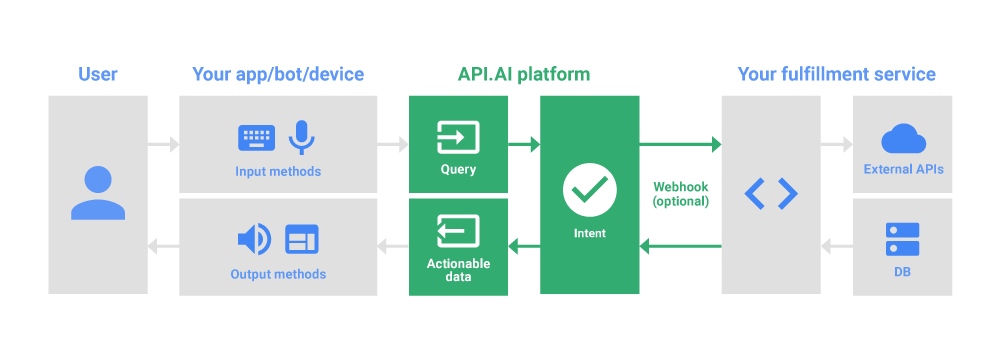

# Owlie the Giftbot

[Owlie the Giftbot live](https://owliethegiftbot.herokuapp.com)

### Background

Owlie the Giftbot is a messenger chat web application that recommends gifts to users based on their responses.  Think of Owlie as the user's personal shopper.

After specifying whom the gift will be for (e.g., mom, boyfriend, sister) and gift type, users will receive gift recommendations that they can then filter based on pricing or other criteria.  Users can set reminders for themselves to send gifts, and Owlie will ping users at that time.

The application will use Facebook's Messenger app for user authentication.  Gift recommendations will come from Amazon and Etsy's APIs.

### Functionality & MVP

- [ ] From the front page of the website, users can click on a button that will lead them directly to their Messenger app. If they are not already signed in, the user will be prompted to sign in to their Messenger app
- [ ] The chatbot will be able to give gift suggestions (which show images and prices that are directly linked to the item url) based on the user's input. The chatbot will ask two questions:
  1. Whom is the gift for?
  2. What kind of gift are they interested in?
After getting 5 suggested gift suggestions, users will be provided filter buttons (e.g. price, color, different category). Another set of gift suggestions will be rendered
- [ ] Users can use the chatbot to set reminders for themselves (e.g. "Remind me to send flowers to Aivy on Monday, April 3, 2017)

### Wireframes

The web application will feature a home page with an animated background.  At the top a demo GIF will cycle through the different features of the app.  Users can scroll down the main page to see the features of the app, as well as click on the link to log them into Messenger.  Users log into the app via their Facebook account.

### Technologies & Technical Challenges

This Facebook Messenger chatbot will be implemented using Ruby on Rails, React/Redux, JavaScript, HTML, and CSS. In addition to the `package.json`, there will be the following scripts:
- `api_util.js`: will contain the logic for handling chatbot responses based on user input

The primary technical challenges will be:
- Learning how to work with endpoints. Facebook Messenger provides our app with real-time information (i.e. whenever someone sends our page a message), so we will need to set up an endpoint to receive the POST requests
- Learning how to use the API.AI platform as a middleware to connect our app to Facebook Messenger. We will need to learn how to set up the cycle illustrated below:

- Our app will provide the input and output methods and the responses to the actionable data. We will need to learn how to connect the API.AI platform to our backend so that it could access the data stores
- Setting up a decision tree, where we take the user's input, parse it, and then  determine which action the bot should take
- Setting up the logic for the Reminder feature. We will need to create a model for Reminders that will include the `user_id`, `date_time` of when the user wants to be reminded, and the `subject` of the reminder. We plan to use a library that will allow us to automatically send API requests based on the user's reminders

### Group Members & Work Breakdown

We have three members in our group: Aivy Tran, Dora Chin, and Candra Tran.

Dora's primary responsibilities will be:
- Designing the main page to ensure good UX design
  * Choosing the color scheme for the app
  * Designing the wireframes for the front page
- Parsing the JSON response from Amazon (from our initial AJAX request) for `item_url` and `price`
- Setting up the tables for the Reminders feature

Aivy's primary responsibilities will be:
- Researching about the API.AI platform
- Setting up the webhook endpoints to connect the Facebook Messenger chatbot to API.AI
- Setting up endpoints to connect API.AI to the web application

Candra's primary responsibilities will be:
- Setting up the structure for the dialogue between user and the chatbot
 * Setting up the questions to ask users and the chat responses to reply with
- Setting up the decision tree, which will determine which action the bot will take based on the user's input
- Parsing the user's messages for relevant data to feed into our decision tree

### Implementation Timeline

The app will be built out over five days.

**Day 1:** Set up the project file structure and front page.
- [ ] Set up front page (Aivy)
- [ ] Configure `webpack.config.js` and `package.json` files (Aivy)
- [ ] Create privacy policy page (Dora)
- [ ] Set up Facebook Messenger login page (Candra)

**Day 2:** Set up backend API framework and endpoints and begin decision tree.  Style landing page.
- [ ] Create decision tree for user asking gift recipient and what they would like (Candra)
- [ ] Set up API.AI framework (Aivy)
- [ ] Set up endpoints for Messenger callbacks (Aivy)
- [ ] Research and extract gift data from Amazon and Etsy APIs (Dora)
- [ ] Create and style landing page (Dora)

**Day 3:** Finish up decision tree and landing page styling.  Set up the API to handle user response.
- [ ] Finish decision tree (Candra)
- [ ] Set up app's API for handling user response (Aivy)
- [ ] Create animated background for landing page (Dora)

**Day 4:** Set up reminder and filter recommendation features.  Display shopping options on app.
- [ ] Create reminder table to allow users to add reminders and ping them to users at the specified time (Dora)
- [ ] Implement filter feature based on decision tree (Candra)
- [ ] Set up shopping options on Messenger app based on user response (Aivy)

**Day 5:** Finalize reminder feature and integrating decision tree responses with the app's functionality.  Set up the demo page, production README, and refactor as necessary.
- [ ] Implement option for users to retrieve all their reminders (Dora)
- [ ] Integrate reminder feature with app's main features (Dora)
- [ ] Connect decision tree responses with user responses to app (Candra)
- [ ] Refactor code (Aivy)
- [ ] Create production README (Aivy)
- [ ] Set up demo page (Dora)

### Bonus features
- Have a custom domain
- Set up voice chat (Chatbot will be able to speak)
- Allow in-app, automatic order through Facebook Messenger (using Messenger's payment option feature)
- Deploy it on other platforms, such as Skype, LINE, and Slack
